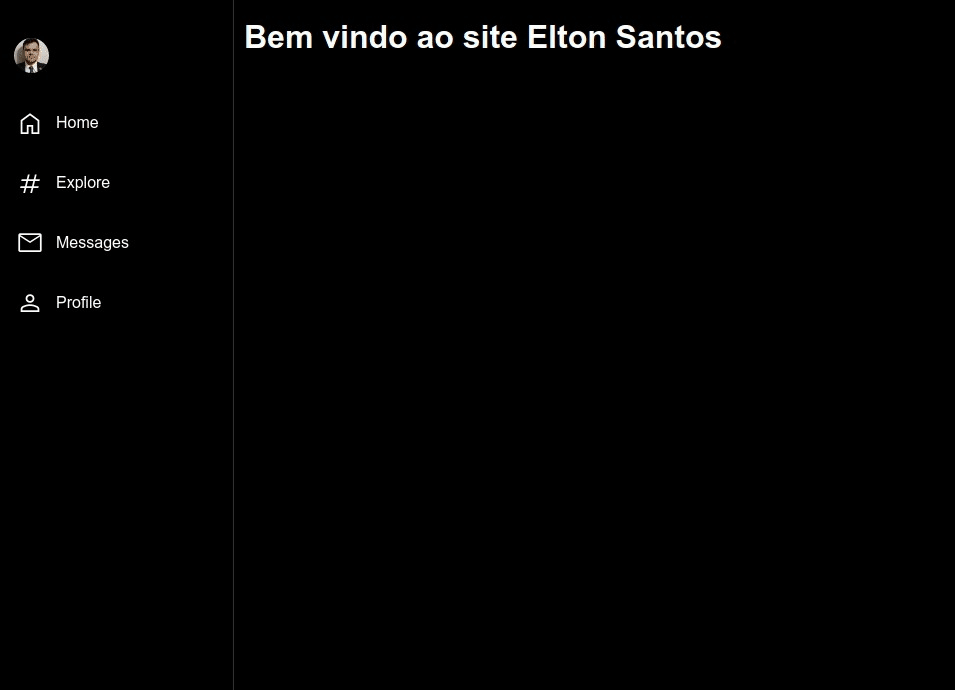
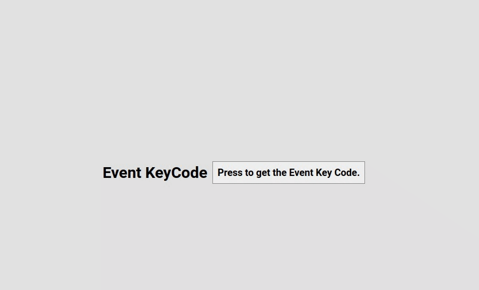
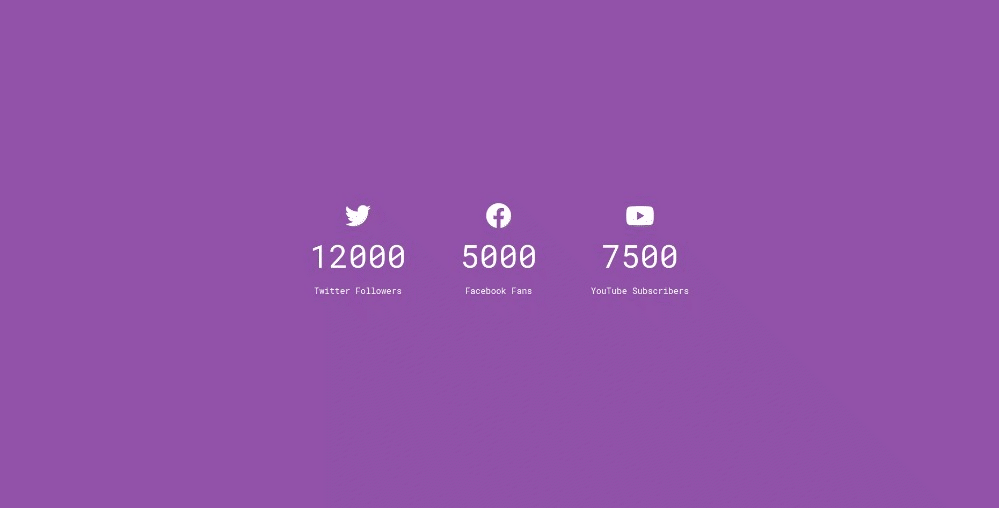

# 50 days 50 projects in Javascript

## Inspirado no tutorial:

https://www.youtube.com/watch?v=esBSu9gRREY&list=PLyMo1HQ5OYSAk7Sjd-uT86vZaGzFFLZCt do WebMentor

E seguindo outros tutoriais também! 🔥

---

## Day 01

### Sidebar responsiva

Tutorial: https://www.youtube.com/watch?v=RlaZjCgTw9M

  

## Day 02

### Menu hamburguer responsivo

Tutorial: https://www.youtube.com/watch?v=NxQfifuErVE

  

## Day 03

### Parallax & ScrollReveal

Tutorial: https://www.youtube.com/watch?v=29vJqTa53gs

  

## Day 04

### Imagens sanfonadas

Tutorial: https://www.youtube.com/watch?v=FP2hKdOjYhM

  

## Day 05

### Imagem carregando

Tutorial: https://www.youtube.com/watch?v=y1skixS1YJw

  

## Day 06

### CSS Animado no scroll

Tutorial: https://www.youtube.com/watch?v=lCXrE1HsfCs

  

## Day 07

### Event KeyCode

Tutorial: https://www.youtube.com/watch?v=moJN-MLY1iM

  

## Day 08

### FAQ Accordion

Tutorial: https://www.youtube.com/watch?v=m2JDjLFcadk

  

## Day 09

### Increment Count Social Media

Tutorial: https://www.youtube.com/watch?v=_YJZ4JZjXBg

  

## Day 10

### Random Choice Picker

Tutorial: https://www.youtube.com/watch?v=-4Rp9Hh5f4Q

  

## Day 11

## Day 12

## Day 13

## Day 14

## Day 15

## Day 16

## Day 17

## Day 18

## Day 19

## Day 20

## Day 21

## Day 22

## Day 23

## Day 24

## Day 25

## Day 26

## Day 27

## Day 28

## Day 29

## Day 30

## Day 31

## Day 32

## Day 33

## Day 34

## Day 35

## Day 36

## Day 37

## Day 38

## Day 39

## Day 40

## Day 41

## Day 42

## Day 43

## Day 44

## Day 45

## Day 46

## Day 47

## Day 48

## Day 49

## Day 50

## 👨🏻‍💻 Author

<h3 align="center">
  
   
  <strong>Elton Santos</strong> 🚀
   
   

 

  

 

Made with ❤️ by Elton Santos 👋🏽 [Entre em contato!](https://www.linkedin.com/in/eltonmelosantos/)

</h3>
